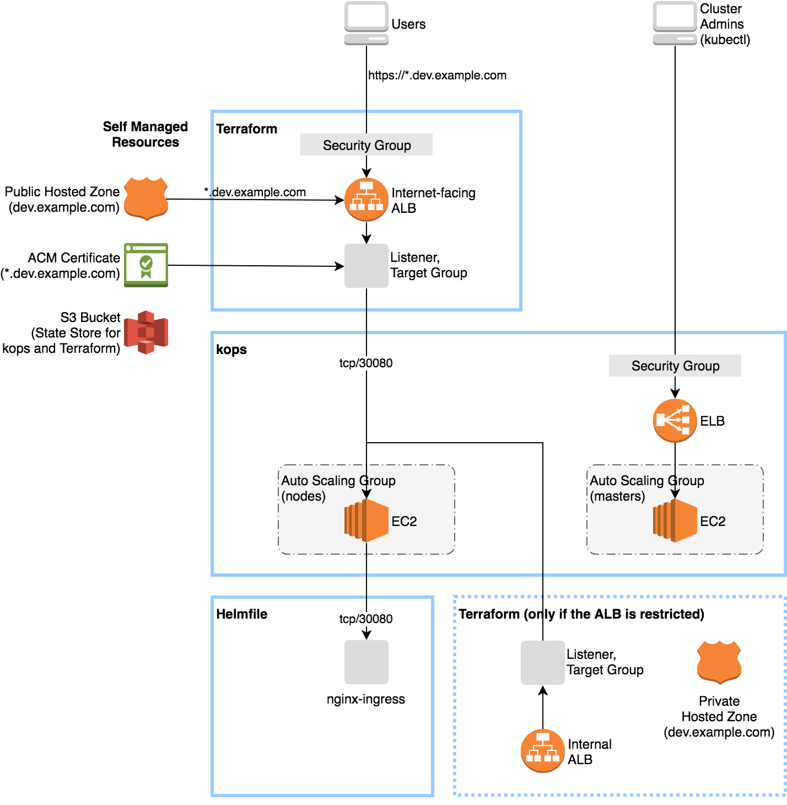

# Kubernetes on AWS with kops and Terraform

This is a starter project with the following stack.



## Goals

- Publish services on Kubernetes cluster.
- You can manage the cluster using `kubectl` and `kops`.
- You can manage the AWS resources using `terraform`.

## Getting Started

### Prerequisite

Make sure you have the following items:

- an AWS account
- an IAM user with [these permissions](https://github.com/kubernetes/kops/blob/master/docs/aws.md)
- a domain or subdomain
- a Route53 public hosted zone for the domain, e.g. `dev.example.com`
- a certificate with the wildcard domain in ACM, e.g. `*.dev.example.com`

Install tools as follows:

```sh
./00-install.sh
```


### 1. Prepare

Change `01-env.sh` with your environment values.
If you do not want to push the environment values to the repository, create `.env` instead.

Load the environment values.

```sh
source ./01-env.sh
```

Then create a S3 bucket for kops and Terraform.

```sh
aws s3api create-bucket \
  --bucket $KOPS_STATE_STORE_BUCKET \
  --region $AWS_DEFAULT_REGION \
  --create-bucket-configuration LocationConstraint=$AWS_DEFAULT_REGION
aws s3api put-bucket-versioning \
  --bucket $KOPS_STATE_STORE_BUCKET \
  --versioning-configuration Status=Enabled
```


### 2. Run kops

In this section, we will create the following components using kops:

- Kubernetes master(s)
- Kubernetes node(s)

Run the following commands:

```sh
# Generate a key pair to connect to EC2 instances
ssh-keygen -f .sshkey

# Configure the cluster
kops create cluster \
  --name ${TF_VAR_kops_cluster_name} \
  --zones ${AWS_DEFAULT_REGION}a,${AWS_DEFAULT_REGION}b,${AWS_DEFAULT_REGION}c \
  --authorization RBAC \
  --ssh-public-key=.sshkey.pub
kops edit cluster --name $TF_VAR_kops_cluster_name
kops edit ig master-${AWS_DEFAULT_REGION}a --name $TF_VAR_kops_cluster_name
kops edit ig nodes --name $TF_VAR_kops_cluster_name

# Create AWS resources
kops update cluster $TF_VAR_kops_cluster_name
kops update cluster $TF_VAR_kops_cluster_name --yes

# Make sure you can access to the cluster
kops validate cluster
kubectl get nodes
```

If you want to create a single AZ cluster, specify a zone as follows:

```yaml
# kops edit ig nodes --name $TF_VAR_kops_cluster_name
spec:
  subnets:
  - us-west-2a
```

#### Restrict IP addresses

You can restrict API access and SSH access by changing the cluster spec.

```yaml
# kops edit cluster --name $TF_VAR_kops_cluster_name
spec:
  kubernetesApiAccess:
  - xxx.xxx.xxx.xxx/32
  sshAccess:
  - xxx.xxx.xxx.xxx/32
```


### 3. Run Terraform

In this section, we will create the following AWS resources using Terraform:

- An internet-facing ALB
- A Route53 record for the internet-facing ALB
- A security group for the internet-facing ALB

Run the following commands:

```sh
# Initialize Terraform
cd ./terraform
terraform init \
  -backend-config="bucket=$KOPS_STATE_STORE_BUCKET" \
  -backend-config="key=terraform.tfstate"

# Create AWS resources
terraform apply
```

#### Restrict IP addresses

You can restrict access to the internet-facing ALB by changing the following in `vars.tf`.

```tf
variable "alb_external_allow_ip" {
  default = [
    "xxx.xxx.xxx.xxx/32",
    "xxx.xxx.xxx.xxx/32",
  ]
}

variable "alb_internal_enabled" {
  default = true
}
```

The additional resources will be created in order to allow the masters and nodes have access to services.

- An internal ALB
- A Route53 private hosted zone for the internal ALB
- A Route53 record for the internal ALB
- A security group for the internal ALB


### 4. Install Kubernetes components

In this section, we will install the following components using Helm:

- nginx-ingress
- heapster
- Kubernetes Dashboard

Run the following commands:

```sh
# Initialize Helm
kubectl create -f config/helm-rbac.yaml
helm init --service-account tiller
helm version

# Install Helm charts
helmfile sync

# Test the ingress controller
sed -i -e "s/TF_VAR_alb_external_domain_name/$TF_VAR_alb_external_domain_name" config/echoserver.yaml
kubectl apply -f config/echoserver.yaml
curl -v https://echoserver.$TF_VAR_alb_external_domain_name
```


## How to change configuration

To change the kops configuration:

```sh
# Load the environment values
source env.sh

# Edit the cluster configuration
kops edit cluster
kops edit ig master-${AWS_DEFAULT_REGION}a
kops edit ig nodes

# Apply changes
kops update cluster $TF_VAR_kops_cluster_name
kops update cluster $TF_VAR_kops_cluster_name --yes
```

To change the Terraform configuration:

```sh
# Load the environment values
source env.sh

# Apply changes
terraform apply
```


## How to destroy the cluster

WARNING: `kops delete cluster` command will delete all EBS volumes tagged.
You should take snapshots before destroying.

```sh
terraform destroy
kops delete cluster --name $TF_VAR_kops_cluster_name --yes
```


## Tips

### Working with managed services

You can attach the security group `allow-from-nodes.hello.k8s.local` to managed services such as RDS.

### Cheap cluster for testing purpose

WARNING: The following configuration is only for testing. Do not use for production.

- Master
  - EC2 (t2.micro instance) -> $0/month
  - Root EBS (standard 10GB) -> $0.5/month
  - etcd EBS (stdandrd 10GB x2) -> $1/month
- Node
  - EC2 (m3.medium spot instance) -> $5/month (price may change)
  - Root EBS (standard 20GB) -> $1/month
- Cluster
  - Persistent Volumes EBS (gp2 ~30GB) -> $0/month
  - Ingress ALB -> $0/month
  - Route53 Hosted Zone -> $0.5/month

If 1 master and 2 nodes are running, they cost $14 per a month.

The cluster name must be a domain name in order to reduce an ELB for masters.

```sh
export TF_VAR_kops_cluster_name=dev.example.com
```

Then change the volume type to `standard` and reduce size:

```yaml
# kops edit cluster --name $TF_VAR_kops_cluster_name
spec:
  etcdClusters:
  - etcdMembers:
    - instanceGroup: master-us-west-2a
      name: a
      volumeSize: 10
      volumeType: standard
    name: main
    version: 3.2.14
  - etcdMembers:
    - instanceGroup: master-us-west-2a
      name: a
      volumeSize: 10
      volumeType: standard
    name: events
    version: 3.2.14
---
# kops edit ig master-us-west-2a --name $TF_VAR_kops_cluster_name
spec:
  machineType: t2.micro
  rootVolumeSize: 10
  rootVolumeType: standard
---
# kops edit ig nodes --name $TF_VAR_kops_cluster_name
spec:
  machineType: m3.medium
  maxPrice: "0.02"
  rootVolumeSize: 20
  rootVolumeType: standard
  subnets:
  - us-west-2a
```

## Contribution

This is an open source software licensed under Apache License 2.0.
Feel free to bring up issues or pull requests.
