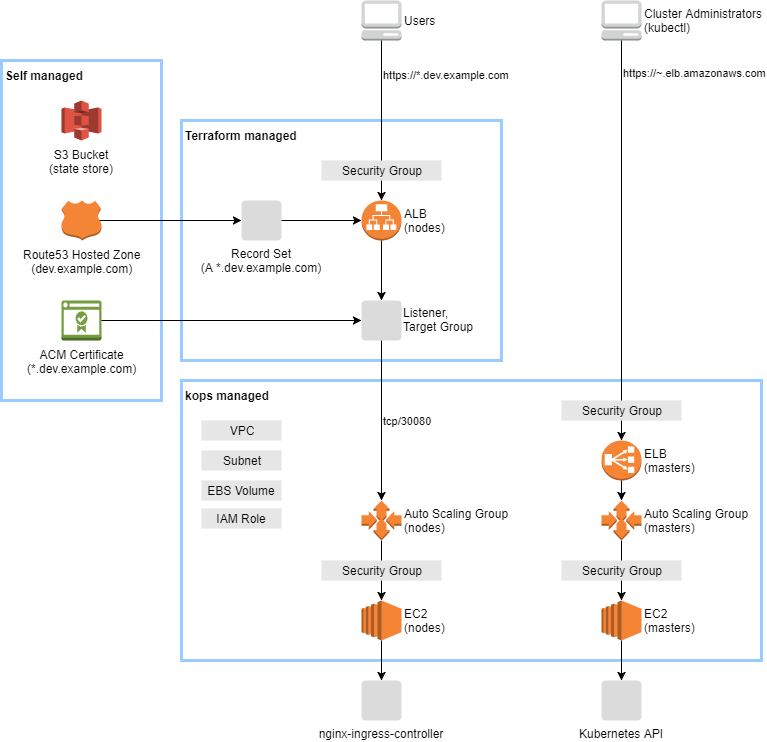

# Kubernetes starter on AWS with kops and Terraform

This is a Kubernetes starter on AWS with kops and Terraform to build the following stack.



## Goals

- You can manage the Kunernetes cluster using `kubectl`.
- You can access to services on the cluster through HTTPS.

## Getting Started

### Prerequisite

You must have the followings:

- a domain or subdomain
- an AWS account
- an IAM user with [these permissions](https://github.com/kubernetes/kops/blob/master/docs/aws.md)
- a Route53 hosted zone for the domain, e.g. `dev.example.com`
- an ACM certificate for the wildcard name, e.g. `*.dev.example.com`

Install the following tools:

```sh
brew install kops
brew install kubernetes-helm
brew install awscli
brew install terraform
curl -L -o ~/bin/helmfile https://github.com/roboll/helmfile/releases/download/v0.11/helmfile_darwin_amd64 && chmod +x ~/bin/helmfile
```

Set the cluster information.

```sh
export TF_VAR_kops_cluster_name=hello.k8s.local
export TF_VAR_alb_external_domain_name=dev.example.com
export AWS_DEFAULT_REGION=us-west-2
export KOPS_STATE_STORE_BUCKET=state.$TF_VAR_kops_cluster_name
export KOPS_STATE_STORE=s3://$KOPS_STATE_STORE_BUCKET
```

### 1. Create a state store

Create a bucket for the kops state store and the Terraform state store.

```sh
aws s3api create-bucket \
  --bucket $KOPS_STATE_STORE_BUCKET \
  --region $AWS_DEFAULT_REGION \
  --create-bucket-configuration LocationConstraint=$AWS_DEFAULT_REGION
aws s3api put-bucket-versioning \
  --bucket $KOPS_STATE_STORE_BUCKET \
  --versioning-configuration Status=Enabled
```

### 2. Create a Kubernetes cluster

Generate a key pair to connect to the EC2 instances.

```sh
ssh-keygen -f .sshkey
```

Create a cluster.

```sh
# Initialize
kops create cluster \
  --name ${TF_VAR_kops_cluster_name} \
  --zones ${AWS_DEFAULT_REGION}a,${AWS_DEFAULT_REGION}b,${AWS_DEFAULT_REGION}c \
  --authorization RBAC \
  --ssh-public-key=.sshkey.pub

# Configure the cluster
kops edit cluster --name $TF_VAR_kops_cluster_name
kops edit ig master-${AWS_DEFAULT_REGION}a --name $TF_VAR_kops_cluster_name
kops edit ig nodes --name $TF_VAR_kops_cluster_name

# Render the cluster
kops update cluster $TF_VAR_kops_cluster_name
kops update cluster $TF_VAR_kops_cluster_name --yes
kops validate cluster
kubectl get nodes
```

If you want to create a single AZ cluster, specify a zone as follows:

```yaml
# kops edit ig nodes --name $TF_VAR_kops_cluster_name
spec:
  subnets:
  - us-west-2a
```

### 3. Create a load balancer

Initialize Terraform.

```sh
cd ./terraform
terraform init \
  -backend-config="bucket=$KOPS_STATE_STORE_BUCKET" \
  -backend-config="key=terraform.tfstate"
```

Create a load balancer and update the Route53 hosted zone.

```sh
terraform apply
```

### 4. Install components

Initialize Helm:

```sh
kubectl create -f config/helm-rbac.yaml
helm init --service-account tiller
helm version
helm repo update
```

Install the following components:

- nginx-ingress
- Heapster
- Kubernetes Dashboard

by

```sh
helmfile sync
```

Test the ingress controller:

```sh
kubectl apply -f config/echoserver.yaml
curl -v https://echoserver.$TF_VAR_alb_external_domain_name
```

## How to destroy

```sh
terraform destroy
kops delete cluster --name $TF_VAR_kops_cluster_name --yes
```

WARNING: `kops delete cluster` command will delete all EBS volumes tagged.
You should take snapshots before destroying.

## Tips

### Working with managed services

You can attach the security group `allow-from-nodes.hello.k8s.local` to managed services such as RDS.

### Restrict access

You can restrict API and SSH access by editing the cluster spec.

```sh
kops edit cluster
```

```yaml
spec:
  kubernetesApiAccess:
  - xxx.xxx.xxx.xxx/32
  sshAccess:
  - xxx.xxx.xxx.xxx/32
```

You can restrict access to services (the external ALB) by Terraform.
You should enable the internal ALB to make the nodes can access to services via the same domain.

```yaml
variable "alb_external_allow_ip" {
  default = [
    "xxx.xxx.xxx.xxx/32",
  ]
}

variable "alb_internal_enabled" {
  default = true
}
```

### Reduce cost for testing purpose

Warning: The following configuration is only for testing. Do not use for production.

- Master
  - EC2 (t2.micro instance) -> $0/month
  - Root EBS (standard 10GB) -> $0.5/month
  - etcd EBS (stdandrd 10GB x2) -> $1/month
- Node
  - EC2 (m3.medium spot instance) -> $5/month (price may change)
  - Root EBS (standard 20GB) -> $1/month
- Cluster
  - Persistent Volumes EBS (gp2 ~30GB) -> $0/month
  - Ingress ALB -> $0/month
  - Route53 Hosted Zone -> $0.5/month

If 1 master and 2 nodes are running, they cost $14 per a month.

At first create a DNS based cluster because a gossip-based cluster requires an ELB for masters.

```sh
export TF_VAR_kops_cluster_name=dev.example.com
```

Configure the cluster as follows:

```yaml
# kops edit cluster --name $TF_VAR_kops_cluster_name
spec:
  etcdClusters:
  - etcdMembers:
    - instanceGroup: master-us-west-2a
      name: a
      volumeSize: 10
      volumeType: standard
    name: main
    version: 3.2.14
  - etcdMembers:
    - instanceGroup: master-us-west-2a
      name: a
      volumeSize: 10
      volumeType: standard
    name: events
    version: 3.2.14
```

```yaml
# kops edit ig master-us-west-2a --name $TF_VAR_kops_cluster_name
spec:
  machineType: t2.micro
  rootVolumeSize: 10
  rootVolumeType: standard
```

```yaml
# kops edit ig nodes --name $TF_VAR_kops_cluster_name
spec:
  machineType: m3.medium
  maxPrice: "0.02"
  rootVolumeSize: 20
  rootVolumeType: standard
  subnets:
  - us-west-2a
```

## Contribution

This is an open source software licensed under Apache License 2.0.
Feel free to bring up issues or pull requests.
